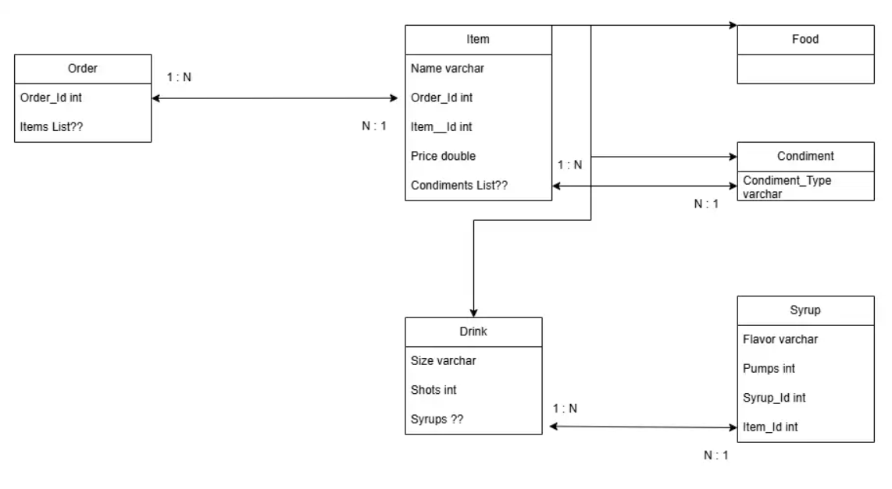

# Online Cafe ordering Service
This is a Web App made in .NET to allow customers to Order from a menu of food and drinks, as well as customize their items. 

## Project Members
Justin Theyskens

## Project Requirements
- README that describes the application and its functionalities
- ERD of your DB
- The application should be ASP.NET Core application
- The application should build and run
- The application should have unit tests and at least 20% coverage (at least 5 unit tests that tests 5 different methods/functionality of your code)
- The application should communicate via HTTP(s) (Must have POST, GET, DELETE)
- The application should be RESTful API
- The application should persist data to a SQL Server DB
- The application should communicate to DB via EF Core (Entity Framework Core)

## Tech Stack

- C# (Back End Programming Language)
- SQL Server (Azure Hosted)
- EF Core (ORM Tech)
- ASP.NET (Web API Framework)

## User Stories
- User should be able to create an Order & assign their name to that order.
- User should be able to Add a Food item to their Order.
- User should be able to add Condiment to their item.
- User should be able to Add a Drink item to their Order.
- User should be able to customize their Drink Order with customizations such as:
        - Size
        - Drink Type
        - Number of Espresso shots
        - Add Syrups to their drink

## ER Diagram

- ER Diagram can be visible here:
https://drive.google.com/file/d/1vvLXxnqaD4L-aHc7T2MTR9Is7QJ8eZ5Q/view?usp=sharing

## MVP Goals
- Customers can create a new order.
- Customers can view all items currently in that order.
- Customers can view all food or drink items available to add to their order.
- Customers can see the cost of each item.
- Customers can add food or drink items to their order.
- Customers can see the total cost of their current order.

